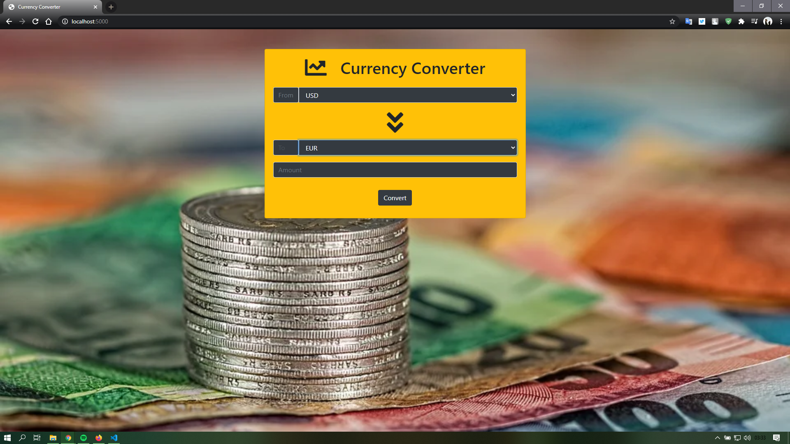

# CurrencyConverterWithFlask-v1.0-
<h2> Information </h2>
It is a simple "Currency Converter" project with Flask Framework, Bootstrap 4, Requests Library and Fixer API

<h2> Get Started </h2>
Codes that must be run in the terminal for this project to work: 
<ul>
  <li>pip install -U Flask</li>
  <li>pip install requests</li>
</ul>

<h2> Documentation </h2>
<ul>
  <li> For Flask Framework documentation, click <a href="https://getbootstrap.com/docs/4.5/getting-started/introduction/">here</a>.</li>
  <li> For Bootstrap 4 documentation, click <a href="https://getbootstrap.com/docs/4.5/getting-started/introduction/">here</a>.</li>
  <li> For Requests Library documentation, click <a href="https://requests.readthedocs.io/en/master/">here</a>.</li>
</ul>

<h2> What is Currency Converter? </h2>

 A currency converter is software code that is designed to convert one currency into another in order to check its corresponding value. The code is generally a part of a web site or it forms a mobile app and it is based on current market or bank exchange rates.
  
In order to convert one currency into another, a user enters an amount of money (e.g. '1000') and chooses the currency he/she wishes to check the monetary value of (e.g. 'United States Dollar'). After that, the user selects one, or sometimes several other currencies, he/she would like to see the result in. The application software then calculates and displays the corresponding amount of money.If you want to see an advanced currency converter,click <a href="https://www.xe.com/currencyconverter/">here</a>. 

<h2> Screenshots </h2>
<ul>
  <li> Project user interface.

      
  </li>
  <li> The view when currencies are selected.

      
  </li>
  <li> The view when currency transaction is done.

      
  </li>
</ul>
<h2> Information</h2>
I used <a href="fixer.io"> fixer.io </a> free account so currency values are updated once an hour hour. Plus this, the design is quite simple.

